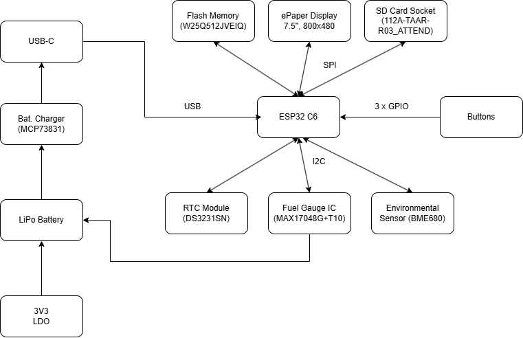

### ESP32-C6 pin connections
* 3V3 - charging 3V3
* EN - Reset button
* IO0 - pin for communication with the RTC (to get alert or timing signals)
* IO1 - pin used to communicate with the RTC to get a stable clock reference
* IO2 - used for SPI (Master In Slave Out)
* IO3 - used to connect to display, indicates the display's busy status
* IO4 - used to communicate with the SD card
* IO5 - used to connect to the display, distinguishes between data and command signals sent to
        to the display
* IO6 - used for SPI communication, synchronizes data transfer
* IO7 - used for SPI (Master Out Slave In)
* IO8 - not used
* IO9 - Boot button
* IO10 - used to connect to the display, selects the display for communication
* IO11 - selects the flash memory for communication
* IO12 - D+ for USB connection
* IO13 - D- for USB connection
* IO15 - Change button
* TXd0 / GPIO16 - used for UART debugging
* RXD0/GPIO17 - used for UART debugging
* IO18 - resets RTC
* IO19 - power pin for I2C communication
* IO20 - power for display
* IO21 - used for I2C, data pin
* IO22 - used for I2C, clock pin
* IO23 - resets display
* GND - connected to GND

### Bill of Materials

| Part | Value | Datasheet Link |
|:------|:-------|:----------------|
| BOOT_BUTTON | BUTTON_CUSYOMV1 | [Datasheet](https://www3.panasonic.biz/ac/e_download/control/switch/light-touch/catalog/sw_lt_eng_6s_th.pdf?f_cd=402892) |
| C1 | 100nF | [Datasheet](https://ro.mouser.com/datasheet/2/447/KEM_C1006_X5R_SMD-3316465.pdf) |
| C1_BAT | 4.7uF | [Datasheet](https://ro.mouser.com/datasheet/2/447/KEM_C1006_X5R_SMD-3316465.pdf) |
| C1_BAT1 | 4.7uF |  |
| C1_BAT2 | 4.7uF |  |
| C2 | 100nF |  |
| C2_BAT | 4.7uF |  |
| C3 | 100uF TANT |  |
| C4 | 4.7uF/25V |  |
| C4_USB | 100nF |  |
| C5 | 1uF |  |
| C5_USB | 4.7uF |  |
| C6 | 100nF |  |
| C7 | 10uF |  |
| C8 | 100nF |  |
| C9 | 100nF |  |
| C10 | 100nF |  |
| C10_SUPERCAP | | [Datasheet](https://www.snapeda.com/parts/CPH3225A/Seiko+Instruments/view-part/?ref=eda) |
| CHANGE_BUTTON BUTTON_CUSYOMV1 | |  |
| CHG_LED | |[Datasheet](https://dammedia.osram.info/media/resource/hires/osram-dam-14795755/LG%20R971_EN.pdf) |
| C_DELAY | 100nF |  |
| D1 | | [Datasheet](https://www.snapeda.com/parts/USBLC6-2SC6Y/STMicroelectronics/view-part/?ref=eda) |
| D2 |  |  |
| D3 |  | [Datasheet](https://www.snapeda.com/parts/MBR0530/Onsemi/view-part/?ref=eda) |
| D4 | | [Datasheet](https://www.snapeda.com/parts/MBR0530/Onsemi/view-part/?ref=eda) |
| D5 |  | [Datasheet](https://www.snapeda.com/parts/MBR0530/Onsemi/view-part/?ref=eda) |
| D6 |  | [Datasheet](https://www.snapeda.com/parts/PGB1010603MR/Littelfuse/view-part/?ref=eda) |
| D7 |  |  |
| D8 |  | [Datasheet](https://www.snapeda.com/parts/PGB1010603MR/Littelfuse/view-part/?ref=eda) |
| D9 || [Datasheet](https://www.snapeda.com/parts/PGB1010603MR/Littelfuse/view-part/?ref=eda) |
| D10 |  | [Datasheet](https://www.snapeda.com/parts/PGB1010603MR/Littelfuse/view-part/?ref=eda) |
| D11 |  | [Datasheet](https://www.snapeda.com/parts/PGB1010603MR/Littelfuse/view-part/?ref=eda) |
| D12 |  | [Datasheet](https://www.snapeda.com/parts/PGB1010603MR/Littelfuse/view-part/?ref=eda) |
| EPD_C1 | 1uF/50V | [Datasheet](https://ro.mouser.com/datasheet/2/396/TDK_4_24_2024_MAASU32NSB7105KTCA01_SS-3440852.pdf) |
| EPD_C2 | 1uF/50V |  |
| EPD_C5 | 1uF/50V |  |
| EPD_C6 | 1uF/50V |  |
| EPD_C7 | 1uF/50V |  |
| EPD_C8 | 1uF/50V |  |
| EPD_C9 | 1uF/50V |  |
| EPD_C10 | 1uF/50V |  |
| EPD_C11 | 1uF/50V |  |
| EPD_C12 | 1uF/50V |  |
| IC2 |  | [Datasheet](https://datasheet.datasheetarchive.com/originals/distributors/Datasheets_SAMA/f2b9741ef86007909f138d561a359946.pdf) |
| IC4 | | [Datasheet](https://www.torexsemi.com/file/xc6220/XC6220.pdf) |
| J1 |  | [Datasheet](https://www.hirose.com/en/product/document?clcode=CL0580-1255-6-99&productname=FH34SRJ-24S-0.5SH(99)&series=FH34SRJ&documenttype=2DDrawing&lang=en&documentid=0000990903) |
| J2 | | [Datasheet](https://gct.co/files/drawings/usb4110.pdf) |
| J3 |  | [Datasheet](https://cdn-shop.adafruit.com/product-files/4208/4208_Kaweei_C13396_diagram.pdf) |
| J4 | | [Datasheet](https://www.attend.com.tw/data/download/file/112A-TAAR-R03.pdf) |
| L1 | 68uH | [Datasheet](https://ro.mouser.com/datasheet/2/390/CR75-514217.pdf) |
| PFMF.050.1 | ESP32C6_VARISTORCN1812 | [Datasheet](www.farnell.com/datasheets/49238.pdf) |
| Q1 | 20V/4.2A/52m?/1.4W | [Datasheet](https://www.diodes.com/assets/Datasheets/DMG2305UX.pdf) |
| Q2 | 20V/4.2A/52m?/1.4W |  |
| R1 | 10K | [Datasheet](https://www.vishay.com/doc?20037) |
| R1_BAT | 200 | [Datasheet](https://www.vishay.com/doc?60057) |
| R1_PINH | 10K |  |
| R1_PINH1 | 10K |  |
| R1_PWRUSB | 100K | [Datasheet](https://ro.mouser.com/datasheet/2/414/TTRB_S_A0010186342_1-2565648.pdf) |
| R2 | 2.2 |  |
| R2-PINH1 | 10K |  |
| R2-USB | 5k1 | [Datasheet](https://www.vishay.com/doc?20008) |
| R2-USB1 | 5k1 |  |
| R2_BAT | 2K |  |
| R2_PINH | 10K |  |
| R3 | 0.47 |  |
| R4 | 10K |  |
| R5 | 10K |  |
| R6 | 10K |  |
| R7 | 10K |  |
| R8 | 10K |  |
| R9 | 10K |  |
| R10 | 10K |  |
| RESET_BUTTON | BUTT |  |
| R_BOOT | 10K |  |
| R_CAPACITOR | 15 |  |
| R_CHANGE | 10K |  |
| R_CL1 | 10K |  |
| R_RESET | 10K |  |
| SJ1 | |  |
| U1 | | [Datasheet](https://www.snapeda.com/parts/ESP32-C6-WROOM-1-N8/Espressif+Systems/view-part/?ref=eda) |
| U2 |  | [Datasheet](https://ro.mouser.com/datasheet/2/268/MCP73831_Family_Data_Sheet_DS20001984H-3441711.pdf) |
| U3 | | [Datasheet](https://ro.mouser.com/datasheet/2/609/DS3231-3421123.pdf) |
| U4 | | [Datasheet](https://www.snapeda.com/parts/MAX17048G+T10/Analog+Devices/view-part/?ref=eda) |
| U5 |  | [Datasheet](https://www.snapeda.com/parts/W25Q512JVEIQ/Winbond+Electronics/view-part/?ref=eda) |
| U6 |  | [Datasheet](https://ro.mouser.com/datasheet/2/783/BST_BME680_DS001-1509608.pdf) |

## Block diagram

## System Overview

This project integrates various components to create a versatile and efficient system with multiple functionalities.

## Components

### ESP32-C6-WROOM-1-N8 Microcontroller
- Serves as the central processing unit, managing all communication and control.
- Supports **Wi-Fi**, **Bluetooth**, **Zigbee**, and **Thread** for wireless communication.

### RTC Module (DS3231SN)
- Maintains accurate timekeeping and provides time/date information via the **I2C protocol**.

### Flash Memory (W25Q512JVEIQ)
- Provides high-speed storage using the **SPI protocol**
- Used for firmware and data storage

### Battery Management IC (MCP73831)
- Handles charging of the Li-Ion battery with input from the USB Type-C port.
- GPIO pins monitor charging status and control power management.

### Fuel Gauge IC (MAX17048G+T10)
- Tracks the battery's state of charge and communicates with the microcontroller using **I2C protocol**.

### Environmental Sensor (BME680)
- Monitors temperature, humidity, pressure, and gas levels.
- Connects via the **I2C protocol**.

### ePaper Display
- Displays information to the user.
- Interfaced using the **SPI protocol** for fast data updates.

### SD Card Socket (J4)
- Provides expandable storage for data logging or firmware updates.
- Communicates using the **SPI protocol**.

### USB Type-C Port (J2)
- Supplies power to the system and enables communication with external devices.
- Includes **D+** and **D−** lines for USB data transfer.
